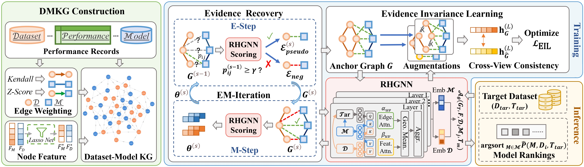

# MERIT

MERIT (**M**odel **E**vidence **R**ecovery and **I**nvariance **T**raining) ranks candidate graph neural networks using benchmark evidence, a dataset-model knowledge graph, evidence recovery and invariance learning.



## Structure

```text
MERIT/
  assets/    Framework figures
  configs/   Scenario parameters, seeds and feature masks
  data/      Benchmark inputs
    graph_nc.npz
    graph_lp.npz
    nas.npz
    graphgym.npz
    actual_nc.npz
    actual_lp.npz
    actual_nas.npz
  merit/     Model implementation
  scripts/   Run scripts
  results/   Generated results
```

## Quick Start

Graph-NC, Complete:

```sh
python scripts/run_merit.py --scenario complete --dataset Graph-NC --hid-dim 64 --n-layers 3 --n-heads 8 --epochs 500 --lr 0.0003 --edge-weight-alpha 2.0
```

Graph-LP, Incomplete (`rho=0.3`):

```sh
python scripts/run_merit.py --scenario incomplete --dataset Graph-LP --rho 0.3 --hid-dim 128 --n-layers 1 --n-heads 8 --epochs 300 --lr 0.0012
```

NAS-Bench-Graph, Incomplete (`rho=0.1`):

```sh
python scripts/run_merit.py --scenario incomplete --dataset NAS --rho 0.1
```

GraphGym, Incomplete (`rho=0.5`):

```sh
python scripts/run_merit.py --scenario incomplete --dataset GraphGym --rho 0.5
```
